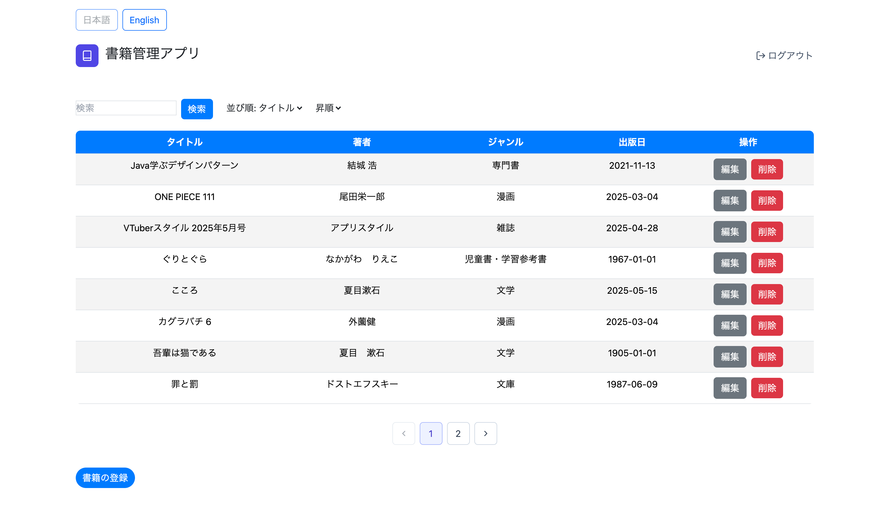
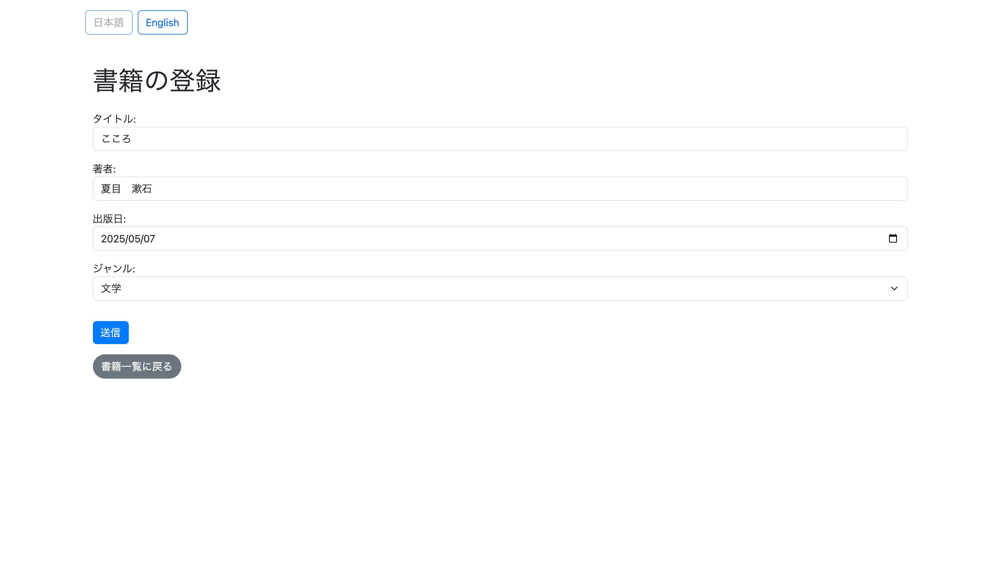

# 📚 BookKeeperjava

**BookKeeperjava** は、書籍の登録、編集、削除、検索、並び替えなどの機能を備えた書籍管理アプリケーションです。

## 🖼️ スクリーンショット

## 🛠️ 機能一覧

- ユーザー認証（ログイン／サインアップ）
- 書籍の登録・編集・削除
- ジャンル選択（文学、雑誌、漫画、文庫、文芸書、専門書、児童書・学習参考書）
- 検索・並び替え機能（昇順／降順）
- 多言語対応（日本語／英語）
- Bootstrap によるスタイリング

## 🧪 使用技術・バージョン

### フロントエンド

| 技術           | バージョン例（※`package.json` から） |
|----------------|-------------------|
| React          | 18.x              |
| React DOM      | 18.x              |
| React Router   | 6.x               |
| i18next        | 23.x              |
| react-i18next  | 13.x              |
| Bootstrap      | 5.x               |
| Axios          | 1.x               |

### バックエンド

| 技術             | バージョン例（※`pom.xml` から） |
|------------------|---------------------|
| Java             | 17 または 21        |
| Spring Boot      | 3.x                 |
| Spring Security  | 6.x                 |
| Spring Data JPA  | 3.x                 |
| H2 Database      | 2.x                 |
| Maven            | 3.8.x 以上          |

### 開発補助ツール

| ツール           | バージョン例             |
|------------------|--------------------------|
| ESLint           | 8.x                      |
| Prettier         | 3.x                      |
| Git              | 2.34.x 以上              |
| Node.js          | 18.x または 20.x         |
| npm              | 9.x または 10.x          |

